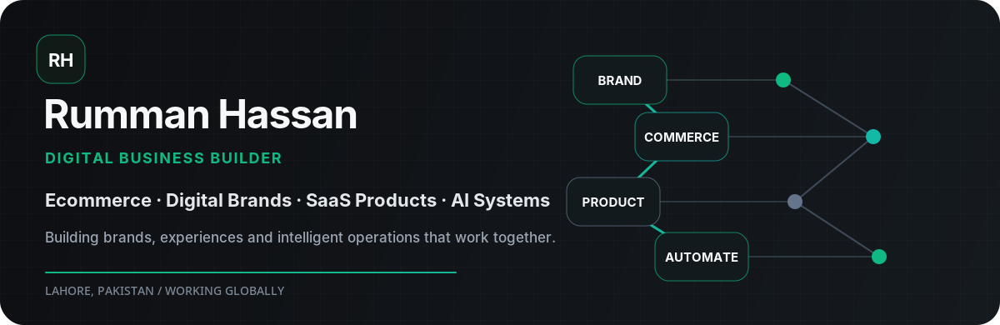
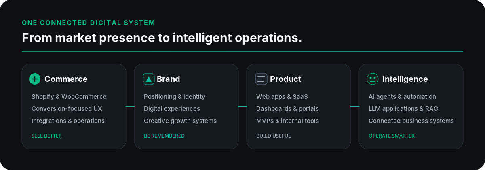

  

  
  
  

  I build <strong>digital brands, ecommerce experiences, SaaS products and intelligent business systems</strong> 
  that help companies launch, grow and operate more effectively.

  <strong>Build the brand. Engineer the experience. Automate the operation.</strong>

---

  

What I Build

  

My work connects four disciplines that are often treated separately: brand, commerce, product and automation. The goal is not to ship isolated assets. It is to build a coherent digital system in which positioning, customer experience, technology, marketing and operations reinforce one another.
<table>
<tr>
<td width="50%" valign="top">
Ecommerce Development & Conversion
Conversion-focused ecommerce stores and customer experiences built for product businesses.
Shopify and Shopify Plus development
WooCommerce and WordPress ecommerce
Custom Shopify themes with Liquid
Product pages, landing pages and CRO
Klaviyo, CRM, payment, inventory and order integrations
</td>
<td width="50%" valign="top">
Digital Branding & Growth
Clear, memorable and commercially effective digital brand experiences.
Digital positioning and brand direction
Website and ecommerce experience design
Customer journey and campaign planning
Social creative and promotional systems
Digital growth strategy for product brands
</td>
</tr>
<tr>
<td width="50%" valign="top">
Web Applications & SaaS
Useful digital products that solve operational and customer problems.
SaaS products and MVP development
Dashboards, admin portals and internal tools
Customer portals and self-service systems
Responsive frontend development
API integrations and connected platforms
</td>
<td width="50%" valign="top">
AI Agents & Automation
Reliable systems that connect tools, data, workflows and human decisions.
AI agents and agentic workflows
Business process automation
LLM applications, RAG and knowledge assistants
n8n, Make and Zapier orchestration
Ecommerce, CRM, reporting and support automation
</td>
</tr>
</table>

<strong>View the complete capability list</strong>

 
Ecommerce: Shopify, Shopify Plus, WooCommerce, WordPress, custom Liquid development, ecommerce redesign, conversion optimization, mobile-first shopping experiences, Klaviyo and operational integrations.
Brand & Growth: brand positioning, digital identity direction, web experience design, customer journey planning, landing pages, campaign experiences, social creative direction, content assets and ecommerce growth systems.
Web & SaaS: SaaS product development, business dashboards, internal tools, AI-powered applications, customer portals, product prototyping, MVPs, frontend development and API-based platforms.
AI & Automation: AI agents, workflow orchestration, OpenAI and Claude integrations, human-in-the-loop approvals, CRM automation, reporting, data synchronization, support assistants, research workflows, chatbots and voice agents.

---
Current Focus
Building conversion-focused Shopify and ecommerce experiences
Designing digital brand systems for modern product businesses
Developing SaaS products, dashboards and operational tools
Connecting ecommerce operations with AI agents and workflow automation
Exploring Codex-assisted software development and local computer automation
Creating reusable n8n and API-based business systems
---
Experience
I have spent more than five years working across ecommerce development, web design, digital branding, marketing, product development and automation. That multidisciplinary background helps me see the full system—not only the website, campaign or AI workflow in isolation.
My commercial ecommerce work and emerging AI initiatives are developed through dedicated ventures, while my personal work remains focused on connecting brand, commerce, technology, customer experience and intelligent operations.
---
Technology

  
  
  
  
  
  
  
  

Ecommerce: Shopify · Shopify Plus · WooCommerce · WordPress · Liquid · Klaviyo  
Web & SaaS: HTML · CSS · JavaScript · APIs · Dashboards · Internal Tools  
Design & Branding: Figma · Elementor · Ecommerce UX · Conversion Design  
AI & Automation: OpenAI API · Claude API · AI Agents · RAG · Function Calling · n8n · Make · Zapier  
Conversational AI: WhatsApp Business API · Telegram Bot API · VAPI · ElevenLabs  
Marketing & Operations: Meta Ads · Google Ads · TikTok Ads · HubSpot · Airtable · Notion · Google Workspace
---

  

I start with the business and customer problem, build the smallest useful version, document the system, and improve it using real usage data. I use automation before unnecessary AI and add intelligence only where context, judgment or flexible decision-making creates measurable value.
---
What I Share
I document practical lessons and build notes about:
Shopify development, ecommerce UX and conversion
Digital branding and online business growth
Web applications, SaaS products and internal tools
AI automation, agentic workflows and LLM applications
Codex and AI-assisted software development
Building digital businesses as a self-taught, introverted builder
---
Let’s Connect

  Open to relevant collaborations involving 
  <strong>Ecommerce · Shopify · Digital Branding · Web & SaaS · AI Automation · Business Systems</strong>

  <a href="https://linkedin.com/in/rummanhassan13"><strong>LinkedIn</strong></a>
  &nbsp;·&nbsp;
  <a href="mailto:query@rummanhassan.cv"><strong>Email</strong></a>

  Building brands, digital experiences and intelligent systems from Lahore, Pakistan.

